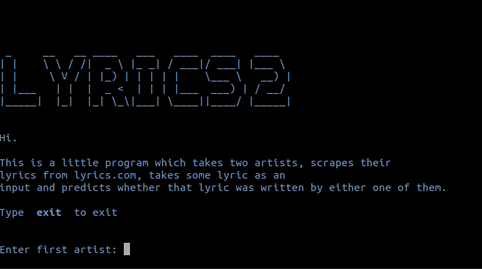

# *LYRICS2*
## Text classification and lyrics-scraping command line tool

This is a little program which takes two artists, scrapes their lyrics from lyrics.com, takes some lyric as an input and predicts wheather that lyric was written by either one of them.

It was written in week 4 of the Spiced Data Science bootcamp.

Through the use of

- Regular Expressions,
- Bag of Words and
- Naive Bayes

*LYRICS2* can predict with some certainty if an input text was written by one of two artists.

## Files

- [`lyrics2_program.py`](lyrics2_program.py): python program of *LYRICS2*